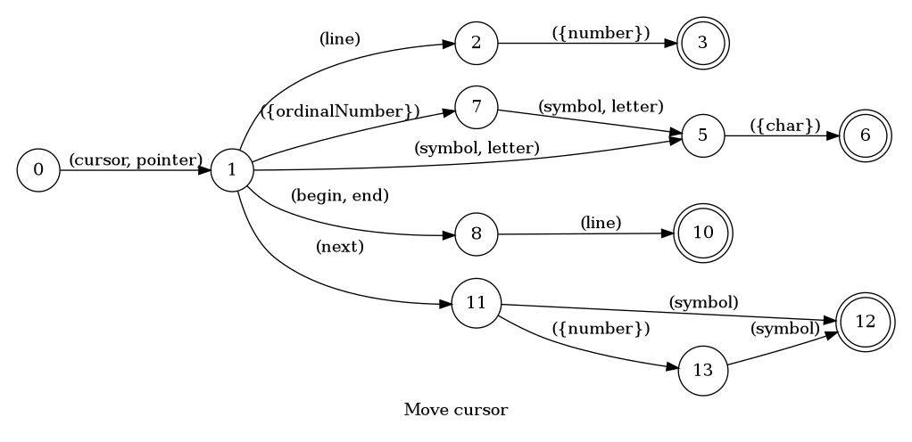

## Move cursor

> 🤖 This document was auto generated by spoken/src/build/build-docs.js

Moves the cursor to a different line or token

### Languages

This command is available in the following languages

#### English

The following automata is responsible for recognizing the command `Move cursor` in english:



The following are some examples of phrases, in english, used to trigger the command `Move cursor`:

1. pointer line 42
2. pointer symbol g
3. cursor 1ª letter M
4. pointer end line
5. cursor next symbol
6. pointer next 1 symbol

#### Português

O automata seguinte é reponsável por reconhecer o comando `Mover o cursor` em português:


Os seguintes exemplos de frases, em português, podem ser usadas para ativar o comando `Mover o cursor`:

1. cursor linha 42
2. cursor letra A
3. cursor último símbolo a
4. ponteiro começo linha
5. ponteiro próximo letra
6. ponteiro próximo 1 símbolo

### Implementation

The full implementation of this command can be found on this directory under the file [impl.ts](impl.ts)

```typescript
import { ParsedPhrase, Editor, WildCard } from '../../d'

async function cursor(args: CursorParsedArgs, editor: Editor, context: {}) {
    console.log('[Spoken]: Executing: "cursor."')

    if (args.linePosition != null) {
        const pos = args.linePosition === LinePostionEnum.BEGIN ? 'BEGI

(...)
```